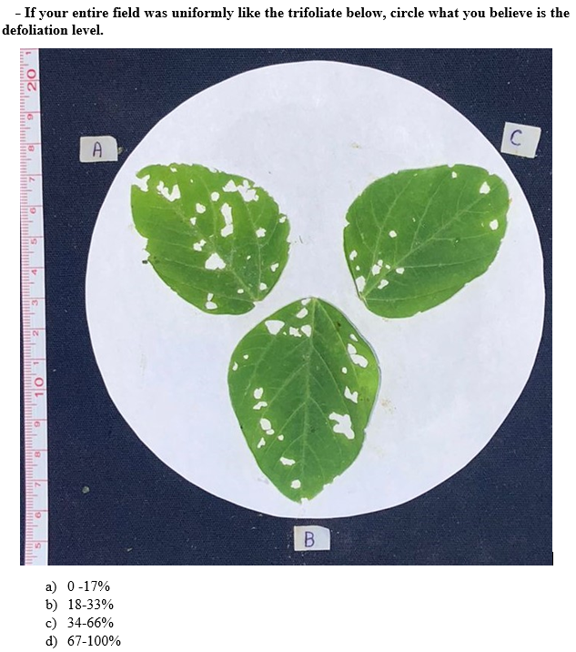

# Background
The North Carolina economic threshold for all defoliating soybean insects during the reproductive stages is 15% of the total leaf area. To estimate defoliation levels, growers and consultants visually estimate soybean trifoliates in the field, potentially leading to insecticide application mistakes by over or underestimation. THe goal of this research is to investigate growers, consultants, extension personell and people's accuracy visually estimating soybean defoliation. I surveyed growers, consultants and extension personnel using a questionnaire with pictures of defoliated leaflets. I asked them about farm size and other demographic information. The following are my hypotheses for the answers I collected with the survey.
**I hypothesize that extension personnel and consultants will estimate defoliation more accurately compared to other occupations.**
**I hypothesized that larger growers will estimate defoliation more accurately compared to smaller growers.**
**I hypothesized that participants that estimate defoliation in their fields will estimate defoliation more accurately compared to participants who do not measure defoliation.**


# Dataset description

We hand distribute a survey in field days. The survey had a total of 18 questions. Questions 1 to 6 refer to participants occupation (Question 1). If they are growers we ask if they use a consultant (Question 2) and how may acres of soybean they plant (Question 3). If they are consultants we asked the acres of crops they are responsible for (Question 4). We asked if they rent equipment to spray insecticides in soybean (Question 5) and if they measure soybean defoliation in their fields or not (Question 6). 
Questions 7 through 18 followed a pattern. We showed a picture of soybean trifoliate at some level of defoliation and ask them which level of defoliation that trifoliate is at. Then, we ask if they would spray a soybean field that had leaflets like that. The defoliation level varied among pictures. We expect the participants not to spray if defoliation level is not over 15% (the threshold). 

Below is an example of question asked in the survey (Q1.1 in the analysis).



```{r, setup, include=FALSE}
knitr::opts_chunk$set(echo = TRUE)
```


``` {r echo=F, warning=F, message=F}
# Loading the packages
library(tidyverse)
library(janitor)
library(dplyr)
library(readr)
library(knitr)
library(ggplot2)
library(kableExtra)
```

```{r, echo=F, warning=F, message=F}
# Loading the dataset
read_csv("data/survey_data.csv") -> dat
```

``` {r, echo=F, warning=F, message=F}

#cleaning column names,table summarizing varible names, column names and units. Format table with kable

data <- dat%>%
  clean_names()%>%
  rename(
    "occupation" = "x1_are_you_a_select_all_that_apply",
    "use_consultant" = "x2_if_you_are_a_grower_do_you_use_a_consultant_if_you_are_not_a_grower_please_ignore_this_questions",
    "area" = "x3_how_many_soybean_acres_do_you_typically_plant_if_you_are_not_a_grower_please_ignore_this_question",
    "consultant_y_n" = "x4_if_you_are_a_consultant_how_many_total_acres_of_crops_are_you_responsible_for_if_you_are_not_a_consultant_please_ignore_this_question",
    "rent_machinery" = "x5_do_you_rent_machinery_to_spray_insecticides_in_your_soybean_fields_if_you_are_not_a_farmer_please_ignore_this_question",
    "measure_defol" = "x6_do_you_measure_defoliation_in_your_field_or_in_the_fields_that_you_are_responsible_for",
  "Q1.1" = "x7_if_your_entire_field_was_uniformly_like_the_trifoliate_below_circle_what_you_believe_is_the_defoliation_level",
  "Q1.2" = "x8_if_your_field_was_in_reproductive_growth_stages_blooms_or_pods_present_and_you_found_the_trifoliates_through_the_canopy_like_this_would_you_spray_it",
  "Q2.1" = "x9_if_your_entire_field_was_uniformly_like_the_trifoliate_below_circle_what_you_believe_is_the_defoliation_level",
  "Q2.2" = "x10_if_your_field_was_in_reproductive_growth_stages_blooms_or_pods_present_and_you_found_the_trifoliates_through_the_canopy_like_this_would_you_spray_it",
  "Q3.1" = "x11_if_your_entire_field_was_uniformly_like_the_trifoliate_below_circle_what_you_believe_is_the_defoliation_level",
  "Q3.2" = "x12_if_your_field_was_in_reproductive_growth_stages_blooms_or_pods_present_and_you_found_the_trifoliates_through_the_canopy_like_this_would_you_spray_it",
  "Q4.1" = "x13_if_your_entire_field_was_uniformly_like_the_trifoliate_below_circle_what_you_believe_is_the_defoliation_level" ,
  "Q4.2" = "x14_if_your_field_was_in_reproductive_growth_stages_blooms_or_pods_present_and_you_found_the_trifoliates_through_the_canopy_like_this_would_you_spray_it",
  "Q5.1" = "x15_if_your_entire_field_was_uniformly_like_the_trifoliate_below_circle_what_you_believe_is_the_defoliation_level",
  "Q5.2" = "x16_if_your_field_was_in_reproductive_growth_stages_blooms_or_pods_present_and_you_found_the_trifoliates_through_the_canopy_like_this_would_you_spray_it",
  "Q6.1" = "x17_if_your_entire_field_was_uniformly_like_the_trifoliate_below_circle_what_you_believe_is_the_defoliation_level",
  "Q6.2" = "x18_if_your_field_was_in_reproductive_growth_stages_blooms_or_pods_present_and_you_found_the_trifoliates_through_the_canopy_like_this_would_you_spray_it",
  "event" = "which_event_was_this_form_distributed_at"
  ) %>%
  dplyr::select(-c(timestamp,score)) %>%
  slice(-c(239,240))
  #getting rid of columns/rows I wont need in my dataset
  # summarizing variables with kable
variable_summary <- data.frame(
  Variable_Name = c(
    "Occupation", "Area", "Measure Defoliation",
    "Visual estimate (0-17%)", "Spray field?", "Visual estimate (18-33%)", "Spray field?", "Visual estimate (0-17%)", "Spray field?",
    "Visual estimate (34-66%)", "Spray field?", "Visual estimate (0-17%)", "Spray field?", "Visual estimate(18-33%)", "Spray field?"
  ),
  Column_Name = c(
    "occupation",
    "area",
    "measure_defol",
    "Q1.1",
    "Q1.2",
    "Q2.1",
    "Q2.2",
    "Q3.1",
    "Q3.2",
    "Q4.1",
    "Q4.2",
    "Q5.1",
    "Q5.2",
    "Q6.1",
    "Q6.2"
  ),
  Units = c(
    "Other, Extension personell, Farm manager/consultant, Independent crop consultant,Grower, Retail crop consultant, Agribusiness person (non-consultant)", 
    "0 - 50ac, 50 - 250ac, 250 - 1000ac, 1000 - 5000ac",
    "Yes/No",
    "0-17%, 18-33%, 34-66%, 67-100%",
    "Yes/No", 
    "0-17%, 18-33%, 34-66%, 67-100%",
    "Yes/No", 
    "0-17%, 18-33%, 34-66%, 67-100%", 
    "Yes/No",
    "0-17%, 18-33%, 34-66%, 67-100%", 
    "Yes/No", 
    "0-17%, 18-33%, 34-66%, 67-100%", 
    "Yes/No", 
    "0-17%, 18-33%, 34-66%, 67-100%", 
    "Yes/No"
  )
)

# Create the table using kable
kable(
  variable_summary,
  col.names = c("Variable Name", "Column Name", "Units"),
  caption = "<b style='color:black;'>Table 1: Summary of variables in survey soybean defoliation data set</b>",
) %>%
   kable_styling(bootstrap_options = c("striped", "hover", "condensed", "responsive"))

  
```


# Methods 
## Data tidying and wrangling: 
* To tidy the data, I changed the names of the columns, I deleted columns that were not useful for the analysis and got rid of empty rows. 
* I transformed all of the answers of questions regarding the defoliation levels into "pass"or "fail" and then to factors using mutate. 
* I ran the logistic regression and extract the model coefficients.
* I plotted the model coefficients, which is the odd ratio.
* I made a function so my analysis would work for the other questions.

## Statistical Analysis: 
I performed a logistic regression to analyze the data collected from the surveys with the purpose of finding differences in the visual estimation of soybean defoliation depending on the interviewers familiarity with soybeans.To check on those hypotheses we ran a logistic regression. If the answer to the question is correct, we consider it a "Pass", if its incorrect a "Fail". Our normal/reference for the variable occupation is "Other", for  "Area size" it is "0 - 50ac", for the variable measure the normal is "Yes". The odds ration given with the analysis is related with the probability of the participant to answer the question correctly. Therefore, the higher the odds ratio, the higher the probability of the participant to answer that question correctly. The normal or reference is set to make a comparison of the odds ratio among the variables. For example, for variable "Occupation", the normal is "Others", so the odd ratio generated will be comparing the probabilities of other occupations to answer the question correctly based on the odd ratio of "Others". 


# Code
###Transforming the data into factors
```{r, echo=T, warning=F, message=F}
# Define the columns and their corresponding values for question regarding defoliation estimate (Q1.1 to Q6.1)
questions_1 <- c("Q1.1", "Q2.1", "Q3.1", "Q4.1", "Q5.1", "Q6.1")
correct_values_1 <- list(
  c("0 - 17%"),
  c("18 - 33%"),
  c("0 - 17%"),
  c("34 - 66%"),
  c("0 - 17%"),
  c("18 - 33%")
)

# Define the columns and their corresponding values for questions regarding spraying or not (Q1.2 to Q6.2)
questions_2 <- c("Q1.2", "Q2.2", "Q3.2", "Q4.2", "Q5.2", "Q6.2")
correct_values_2 <- list(
  c("Yes"),    # Q1.2
  c("Yes"),    # Q2.2
  c("No"),     # Q3.2
  c("Yes"),    # Q4.2
  c("No"),     # Q5.2
  c("Yes")     # Q6.2
)

# Start the data transformation pipeline
data <- data %>%
  
# Transforming Occupation, Area and Measure defoliation or not into factors
  mutate(
    Occupation = sub(",.*", "", occupation),
    Occupation = factor(Occupation, levels = c(
                                                      "Other",   #reference being "others" because is the first occupation being cited here
                                                      "Extension personell", 
                                                      "Farm manager/consultant", 
                                                       "Independent crop consultant",
                                                       "Grower", 
                                                      "Retail crop consultant", 
                                                      "Agribusiness person (non-consultant)"
    )), 
    Area = factor(area, levels = c("0 - 50",
                                       "50 - 250",
                                       "250 - 1000",
                                       "1000 - 5000")),
    Measure = factor(measure_defol, levels = c("Yes", "No"))) %>%
  
  # Apply transformations for Q1.1 to Q6.1 
  mutate(across(
    all_of(questions_1),
    ~ as.factor(case_when(
      . %in% correct_values_1[[which(questions_1 == cur_column())]] ~ "Pass",
      . %in% setdiff(unique(.), correct_values_1[[which(questions_1 == cur_column())]]) ~ "Fail"
    )),
    .names = "{.col}"
  )) %>%
  
  # Apply transformations for Q1.2 to Q6.2 
  mutate(across(
    all_of(questions_2),
    ~ as.factor(case_when(
      . %in% correct_values_2[[which(questions_2 == cur_column())]] ~ "Pass",
      . %in% setdiff(unique(.), correct_values_2[[which(questions_2 == cur_column())]]) ~ "Fail"
    )),
    .names = "{.col}"
  ))


```

###Running the logistic regression for defoliation question Q1.1
```{r, echo=T, warning=F, message=F}
logistic_reg_q1.1 <- glm(Q1.1 ~ Occupation, 
                         data = data,
                         na.action = "na.exclude",
                         family = "binomial")

summary(logistic_reg_q1.1)
```

###model coefficient
```{r, echo=T, warning=F, message=F}
exp(coef(logistic_reg_q1.1))
exp(coef(logistic_reg_q1.1)) -> results
```

###Plot
```{r, echo=T, warning=F, message=F}
occupations <- c("Other",
                "Extension personell", 
               "Farm manager/consultant",
               "Independent crop consultant",
               "Grower", 
               "Retail crop consultant",
               "Agribusiness person(non-consultant)") 

reg_results <- results
 
#creating a df with the variables I want to plot with the results from the regression
data.frame(
           occupations = occupations,
           regression_results = reg_results) -> q1_results

ggplot(q1_results, aes(x = occupations, y = regression_results)) +
  geom_point(size = 4) +
  theme_bw()+
  theme(axis.text.x = element_text(angle = 45, hjust = 1)) +
  labs(
    title = "Visually estimate of defoliation (0-17%) - Q1.1",
    y = "Odds ratio",
    x = "Occupations")
  


```

###Making it a function
```{r, echo=T, warning=F, message=F, fig.width=15, fig.height=6}
run_logistic_regression <- function(data, questions, study_factor, text, legend) {
  # Ensure the study_factor is interpreted as a column name
  study_factor <- rlang::ensym(study_factor) 
  
  # Run logistic regression
  logistic_reg <- glm(as.formula(paste(questions, "~", as.character(study_factor))), 
                      data = data,
                      na.action = "na.exclude",
                      family = "binomial")
  
  # Extract odds ratios and p-values
  odds_ratios <- exp(coef(logistic_reg))  # Odds ratios
  p_values <- summary(logistic_reg)$coefficients[, "Pr(>|z|)"]  # P-values
  
  # Summary regression
  summary_regression <- summary(logistic_reg)
  
  # Define categories and x-label based on study factor
  if (as.character(study_factor) == "Occupation") {
    categories <- c("Other", "Extension personnel", "Farm manager/consultant",
                    "Independent crop consultant", "Grower", 
                    "Retail crop consultant", "Agribusiness person(non-consultant)")
    x_label <- "Occupations"
  } else if (as.character(study_factor) == "Area") {
    categories <- c("0 - 50", "50 - 250", "250 - 1000", "1000 - 5000")
    x_label <- "Area size"
  } else {
    categories <- c("Yes", "No")
    x_label <- "Measure defoliation in their field"
  } 

  # Create results table
  results_table <- data.frame(
    Question = questions,
    Study_Factor = as.character(study_factor),
    Category = categories,
    Odds_Ratio = odds_ratios,
    P_Value = p_values,
    row.names = NULL
  )
  
 
  # Reshape results table to wide format for summary
  results_table_wide <- results_table 
  
  # Create plot for odds ratios
  fig <- ggplot(results_table, aes(x = Category, y = Odds_Ratio)) +
    geom_point(size = 4) +
    theme_bw() +
    theme(axis.text.x = element_text(angle = 75, hjust = 1, size = 10),
          axis.text.y = element_text(size = 10),
          plot.title = element_text(size = 12, face = "bold", hjust = 0.5),
          plot.caption = element_text(size = 12, hjust = 0.5,lineheight = 1.2)) +
    ylim(0, 7) +
    labs(
      title = text,
      y = "Odds ratio",
      x = x_label,
      caption = legend
    )
  
  # Return results table, summary, and plot
  list(results_table_wide = results_table_wide, 
       summary_regression = summary_regression, 
       plot = fig)
}

```

```{r, echo=F, warning=F, message=F}
#Question 1.1 - occupation
result_q1_oc <- run_logistic_regression(data = data,
                        questions = "Q1.1",
                        study_factor = "Occupation",
                        text = "Figure 1: Odds ratio x Occupation (Q1.1)",
                        legend = "Figure 1: Odds of participants to correctly estimate \nsoybean picture with leaftlets defoliated at range of 0-17% based on their occupation")
```

```{r, echo=F, warning=F, message=F}
#Question 2.1 - occupation
result_q2_oc <- run_logistic_regression(data = data,
                        questions = "Q2.1",
                        study_factor = "Occupation",
                        text = "Figure 2: Odds ratio x Occupation (Q2.1)",
                        legend = "Figure 2: Odds of participants to correctly estimate \nsoybean picture with leaftlets defoliated at range of 18-33% based on their occupation")
```


```{r, echo=F, warning=F, message=F}
#Area
result_q2_area <- run_logistic_regression(data = data,
                        questions = "Q2.1",
                        study_factor = "Area",
                        text = "Figure 3: Odds ratio x Area (Q2.1)",
                        legend = "Figure 3: Odds of growers to correctly estimate \nsoybean picture with leaftlets defoliated at range of 18-33% based on their area size")
```


```{r, echo=F, warning=F, message=F}
#Measurement
result_q2_measure <-run_logistic_regression(data = data,
                        questions = "Q2.1",
                        study_factor = "Measure",
                        text = "Figure 4: Odds ratio x Measure (Q2.1)",
                        legend = "Figure 4: Odds of participants to correctly estimate \nsoybean picture with leaftlets defoliated at range of 18-33% based \non whether they estimate defoliation in their fields or not")
```

```{r, echo=F, warning=F, message=F}
#Results Question 3 
#Occupation
result_q3_oc <-run_logistic_regression(data = data,
                        questions = "Q3.1",
                        study_factor = "Occupation",
                        text = "Figure 5: Odds ratio x Occupation (Q3.1)",
                        legend = "Odds of participants to correctly estimate  picture with range 0-17%% defoliation based on whether they estimate defoliation in their fields or not")
```


```{r, echo=F, warning=F, message=F}
#Measurement
result_q3_measure <-run_logistic_regression(data = data,
                        questions = "Q3.1",
                        study_factor = "Measure",
                        text = "Figure 6: Odds ratio x Occupation (Q3.1)",
                        legend = "Odds of participants to correctly estimate  picture with range 0-17% defoliation based on whether they estimate defoliation in their fields or not")
```


```{r, echo=F, warning=F, message=F}
#Results Question 5 
#Occupation

result_q5_oc <- run_logistic_regression(data = data,
                        questions = "Q5.1",
                        study_factor = "Occupation",
                        text = "Figure 7: Odds ratio x Occupation (Q5.1)",
                        legend = "Odds of participant to correctly estimate  picture with range 0-17% defoliation based on their occupation")
```


```{r, echo=F, warning=F, message=F}
#Measurement
result_q5_measure <-run_logistic_regression(data = data,
                        questions = "Q5.1",
                        study_factor = "Measure",
                        text = "Figure 8: Odds ratio x Measure (Q5.1)",
                        legend = "Odds of participant to correctly estimate  picture with range 0-17% defoliation based on whether they measure defoliation in their field or not")
```


# Summary table of results - Odd ratios 
```{r, echo=F, warning=F, message=F}
combined_table_occupation <- bind_rows(result_q1_oc$results_table_wide, 
                            result_q2_oc$results_table_wide, 
                            result_q3_oc$results_table_wide, 
                            result_q5_oc$results_table_wide)
                            
 combined_table_area <- (result_q2_area$results_table_wide)
 
 combined_table_measure <- bind_rows(result_q2_measure$results_table_wide, 
                                    result_q3_measure$results_table_wide, 
                                    result_q5_measure$results_table_wide)


# Display combined table
combined_table_occupation %>%
  kable(escape = FALSE,caption = "Results from Logistic Regression Variable Occupation") %>%
  kable_styling(bootstrap_options = c("striped", "hover", "condensed", "responsive"))

combined_table_area %>%
  kable(escape = FALSE,caption = "Results from Logistic Regression Variable Area") %>%
  kable_styling(bootstrap_options = c("striped", "hover", "condensed", "responsive"))

combined_table_measure %>%
  kable(escape = FALSE,caption = "Results from Logistic Regression Variable Measure") %>%
  kable_styling(bootstrap_options = c("striped", "hover", "condensed", "responsive"))


```


# Visualizations 
```{r}

result_q1_oc$plot

result_q2_oc$plot
result_q2_area$plot
result_q2_measure$plot

result_q3_oc$plot
result_q3_measure$plot

result_q5_oc$plot
result_q5_measure$plot

```


### Explaining the results
Only questions that showed a significant difference in the logistic regression are shown in the summary tables and plots.
Participants occupation influenced the probability of correctly estimating soybean defoliation in all of the photographs that showed leaflets with 0 - 17% defoliation (Q1.1, Q3.1, Q5.1) and 18 - 33% defoliation (Q2.1). In Q1.1, Extension personnel had a significantly higher probability to answer the question correctly compared to participants that had "Other" occupation. In Q2.1, "extension personnel" and "growers" had significantly higher odd ratio compared to "Other". In Q3.1, "Other" and "Agribusiness person (non-consultant)" had significantly higher odd ratio compared to other occupations. In Q5.1 "Others" had significantly higher odd ratio compared to other occupations.

The size area influenced the probability of correctly estimating soybean defoliation in one photograph showing leaflets with 18 - 33% defoliation (Q2.1). Growers that plant an area of 250 - 1000ac had higher odd ratio compared to growers that plant 0 - 50, 50 - 250  and 1000 - 5000ac.

If the participant measures defoliation or not in their fields influenced the probability of correctly estimating soybean defoliation in photographs that showed leaflets with 0 - 17%(Q3.1, Q5.1) and 18 - 33%  defoliation (Q2.1). If participants measure defoliation in their fields or fields that they scout (as consultants/farm manager), the higher was the odd ratio for Q3.1 (p-value = 4.79e-08), Q5.1 (p-value = 1.92e-07) and Q2.1 (p-value = 0.0103)


# Discussion
**I hypothesize that extension personnel and consultants will estimate defoliation more accurately compared to other occupations.**
Extension personnel and consultants have experience going to soybean fields and scouting for insects and defoliation, therefore we hypothesized that they would estimate defoliation more accurate compared to other occupations. The odd ratio for questions Q1.1 show that extension personnel estimate defoliation more accurately compared to other occupations when the leaflets are in defoliation level lower than 17%. Question Q2.1 (Figure 1) shows that farm managers, retail crop consultants and extension personnel estimate defoliation more accurately compared to other occupations when the leaflets are in defoliation level of 18-33%. However, for Q3.1 and Q5.1 Others and Agribusiness person (non-consultant) had higher odd ratio, which was against our hypotheses.

**I hypothesized that larger growers will estimate defoliation more accurately compared to smaller growers.**
The area size only influenced the visual estimation of defoliation for one question. The answers analyzed here were just from growers. My hypotheses was based on the idea that larger growers will have more access to information. For example, they would often be in contact with extension agents and present in field days/meetings where information about the soybean defoliation threshold is shared. In this sense, the Q2.1 showed that growers with 250 - 1000 acres have higher odd ratio compared to other area size growers and so a higher probability of answering the question right. Although this significant difference found for this question might support my hypothesis, no differences in the estimation of defoliation was observed in the other questions based on area size. 

**I hypothesized that participants that estimate defoliation in their fields will estimate defoliation more accurately compared to participants who do not measure defoliation.**
My last hypothesis is that  the simply act of measuring soybean defoliation in the fields would increase the likelihood of the participants to correctly estimate the soybean defoliation shown in the photographs. And that was true for 3 out of the 6 questions showing soybean leaves, 2 of them had leaves at 0-17% defoliation level (Q1.1, Q3.1) and the other 18-33% defoliation (Q2.1).Therefore, if participants measre defoliation in their fields, their odds of correctly estimating soybean defoliation at fields at low levels of defoliation is high. 


